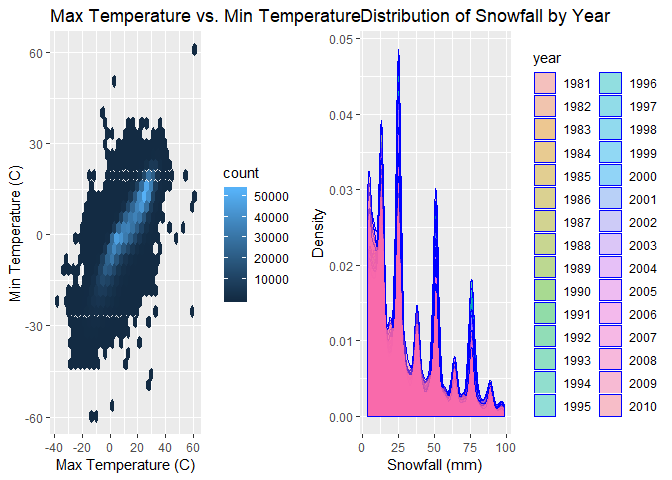

p8105\_hw3\_mp3653
================
Matthew Perrotta
October 10, 2018

### Load packages

``` r
library(tidyverse)
```

    ## -- Attaching packages ----------------------------------------------------------------------------- tidyverse 1.2.1 --

    ## v ggplot2 3.0.0     v purrr   0.2.5
    ## v tibble  1.4.2     v dplyr   0.7.6
    ## v tidyr   0.8.1     v stringr 1.3.1
    ## v readr   1.1.1     v forcats 0.3.0

    ## -- Conflicts -------------------------------------------------------------------------------- tidyverse_conflicts() --
    ## x dplyr::filter() masks stats::filter()
    ## x dplyr::lag()    masks stats::lag()

``` r
library(knitr)
library(patchwork)
library(hexbin)
```

Problem 1
=========

### Import data

``` r
brfss = p8105.datasets::brfss_smart2010 %>% 
  janitor::clean_names() %>% 
  filter(topic == 'Overall Health') %>% 
  filter(response %in% c('Excellent', 'Very good', 'Good', 'Fair', 'Poor')) %>% 
  mutate(response = factor(response, levels = c('Excellent', 'Very good', 'Good', 'Fair', 'Poor'))) %>% 
  rename(state = locationabbr, county = locationdesc)
```

The number of states with 7 observations:

``` r
brfss %>% 
  filter(year == 2002) %>% 
  group_by(state, county) %>% 
  summarize(n = n()) %>% 
  count(state) %>% 
  filter(nn == 7)
```

    ## # A tibble: 3 x 2
    ## # Groups:   state [3]
    ##   state    nn
    ##   <chr> <int>
    ## 1 CT        7
    ## 2 FL        7
    ## 3 NC        7

There are 3 states with 7 observations; CT, FL, and NC.

Create a spaghetti plot

``` r
brfss %>%
  distinct(year, state, county) %>% 
  group_by(year, state) %>% 
  summarize(n = n()) %>% 
  ggplot(aes(x = year, y = n, color = state)) +
  geom_line() +
  labs(
    title = 'Number of Locations in each State by Year',
    x = 'Year',
    y = 'Number of Locations'
  )
```


Create a table displaying the mean of excellent responses across NY counties for the years 2002, 2006, and 2010

``` r
brfss %>% 
  filter(response == 'Excellent',
         state == 'NY',
         year %in% c(2002, 2006, 2010)) %>% 
  group_by(year) %>% 
  summarize(mean_excellent = mean(data_value/100),
            sd_excellent = sd(data_value/100)) %>% 
  knitr::kable()
```

|  year|  mean\_excellent|  sd\_excellent|
|-----:|----------------:|--------------:|
|  2002|        0.2404000|      0.0448642|
|  2006|        0.2253333|      0.0400083|
|  2010|        0.2270000|      0.0356721|

Create plots displaying average response proportion for each state per year

``` r
brfss %>% 
  group_by(state, year, response) %>% 
  summarize(mean_values = mean(data_value/100)) %>% 
  ggplot(aes(x = year, y = mean_values, color = state)) +
  geom_line() +
  facet_grid(~response) +
  theme(axis.text.x = element_text(angle = 90, hjust = 1)) +
  labs(
    title = 'Mean Response Proportion for each State by Year',
    x = 'Year',
    y = 'Mean Proportion'
  )
```

    ## Warning: Removed 1 rows containing missing values (geom_path).


Problem 2
=========

### Import data

``` r
instacart = p8105.datasets::instacart %>% 
  janitor::clean_names()
```

The `instacart` dataset is 1384617 rows with 15 variables and the dataset is in long format. If looking to distinguish the extent of what was ordered, order\_id and product\_id can provide the gross extent of how much is ordered and by whom.

``` r
instacart %>% 
  distinct(order_id) %>% 
  nrow()
```

    ## [1] 131209

``` r
instacart %>% 
  distinct(user_id) %>% 
  nrow()
```

    ## [1] 131209

There are 131209 orders among 131209 users, indicating no users ordered more than once.

Number of aisles

``` r
instacart %>% 
  distinct(aisle_id) %>% 
  nrow()
```

    ## [1] 134

There are 134 aisles

Aisles with the most products ordered

``` r
instacart %>% 
  group_by(aisle) %>% 
  count() %>% 
  arrange(desc(n))
```

    ## # A tibble: 134 x 2
    ## # Groups:   aisle [134]
    ##    aisle                              n
    ##    <chr>                          <int>
    ##  1 fresh vegetables              150609
    ##  2 fresh fruits                  150473
    ##  3 packaged vegetables fruits     78493
    ##  4 yogurt                         55240
    ##  5 packaged cheese                41699
    ##  6 water seltzer sparkling water  36617
    ##  7 milk                           32644
    ##  8 chips pretzels                 31269
    ##  9 soy lactosefree                26240
    ## 10 bread                          23635
    ## # ... with 124 more rows

The top three aisles with the most products ordered are fresh vegatables, fresh fruits, and pacjaged vegetables fruits.

Plot of number of items ordered in each aisle

``` r
instacart %>% 
  group_by(aisle, department) %>% 
  count() %>% 
  ggplot(aes(x = aisle, y = n, color = department)) +
  geom_point() +
  theme(axis.text.x = element_text(angle = 90, hjust = 1)) +
  labs(
    title = 'Number of Items Ordered from Each Aisle',
    x = 'Aisle',
    y = 'Number of Items Ordered'
  )
```


Table of most popular item in the aisles “baking ingredients”, “dog food care”, and “packaged vegetables fruits”

``` r
instacart %>% 
  filter(aisle %in% c('baking ingredients', 'dog food care', 'packaged vegetables fruits')) %>% 
  group_by(aisle) %>% 
  count(product_name) %>% 
  filter(min_rank(desc(n)) < 2) %>% 
  rename(number_of_orders = n) %>% 
  knitr::kable()
```

| aisle                      | product\_name                                 |  number\_of\_orders|
|:---------------------------|:----------------------------------------------|-------------------:|
| baking ingredients         | Light Brown Sugar                             |                 499|
| dog food care              | Snack Sticks Chicken & Rice Recipe Dog Treats |                  30|
| packaged vegetables fruits | Organic Baby Spinach                          |                9784|

Table of mean ordering hour each day of the week for Pink Lady Apples and Coffee Ice Cream

``` r
instacart %>% 
  filter(product_name %in% c('Pink Lady Apples', 'Coffee Ice Cream')) %>% 
  group_by(order_dow, product_name) %>% 
  summarise(mean_order_hour = round(mean(order_hour_of_day))) %>% 
  spread(key = order_dow, value = mean_order_hour) %>% 
  rename(Monday = '0', Tuesday = '1', Wednesday = '2', Thursday = '3', Friday = '4', Saturday = '5', Sunday = '6') %>% #assuming day 0 is monday
  knitr::kable()
```

| product\_name    |  Monday|  Tuesday|  Wednesday|  Thursday|  Friday|  Saturday|  Sunday|
|:-----------------|-------:|--------:|----------:|---------:|-------:|---------:|-------:|
| Coffee Ice Cream |      14|       14|         15|        15|      15|        12|      14|
| Pink Lady Apples |      13|       11|         12|        14|      12|        13|      12|

Problem 3
=========

### Data import

``` r
ny_noaa = p8105.datasets::ny_noaa %>% 
  janitor::clean_names() %>% 
  separate(date, into = c('year', 'month', 'day'), sep = '-') %>% 
  mutate(tmax = as.numeric(tmax),
         tmin = as.numeric(tmin)) %>% 
  mutate(prcp = prcp/10, 
         tmax = tmax/10, 
         tmin = tmin/10)
```

The `ny_noaa` dataset is 2595176 rows with 9 variables and is in long format. Key variables would be `id` which is specific for each station, as well as the date variables. These variables allow for the observation of weather trends overtime for each specific station. There is an extensive amount of data missing, which impedes our ability to properly observe trends. What we observe could be biased by the missing data.

Most commonly observed snowfall values

``` r
ny_noaa %>% 
  select(snow) %>% 
  group_by(snow) %>% 
  count() %>% 
  arrange(desc(n))
```

    ## # A tibble: 282 x 2
    ## # Groups:   snow [282]
    ##     snow       n
    ##    <int>   <int>
    ##  1     0 2008508
    ##  2    NA  381221
    ##  3    25   31022
    ##  4    13   23095
    ##  5    51   18274
    ##  6    76   10173
    ##  7     8    9962
    ##  8     5    9748
    ##  9    38    9197
    ## 10     3    8790
    ## # ... with 272 more rows

The most common observation is `0mm` of snowfall. This is odd in that it often snows every year in the state of NY. This observation may be due to measurement error in that many stations simply did not record or could not record snowfall.

Plot of average max temp in the months of January and July for each station across years

``` r
ny_noaa %>% 
  filter(month %in% c('01', '07')) %>% 
  group_by(id, year, month) %>% 
  summarise(mean_tmax = mean(tmax)) %>% 
  ggplot(aes(x = year, y = mean_tmax)) +
  geom_point() +
  facet_grid('month') +
  theme(legend.position = 'none', axis.text.x = element_text(angle = 90, hjust = 1)) +
  labs(
    title = 'Average Max Temperature (C) in January and July for each Station by Year',
    x = 'Year',
    y = 'Max Temperature (C)'
  )
```

    ## Warning: Removed 7058 rows containing missing values (geom_point).


Two panel plot of of tmax vs tmin and distribution of snowfall

``` r
t_plot = ny_noaa %>% 
  ggplot(aes(x = tmax, y = tmin)) +
  geom_hex() +
  labs(
    title = 'Max Temperature vs. Min Temperature',
    x = 'Max Temperature (C)',
    y = 'Min Temperature (C)'
  )

snow_plot = ny_noaa %>% 
  filter(snow > 0 & snow < 100) %>% 
  ggplot(aes(x = snow, fill = year)) +
  geom_density(alpha = .4, adjust = .5, color = 'blue') +
  labs(
    title = 'Distribution of Snowfall by Year',
    x = 'Snowfall (mm)',
    y = 'Density'
  )

(t_plot + snow_plot)
```

    ## Warning: Removed 1136276 rows containing non-finite values (stat_binhex).


